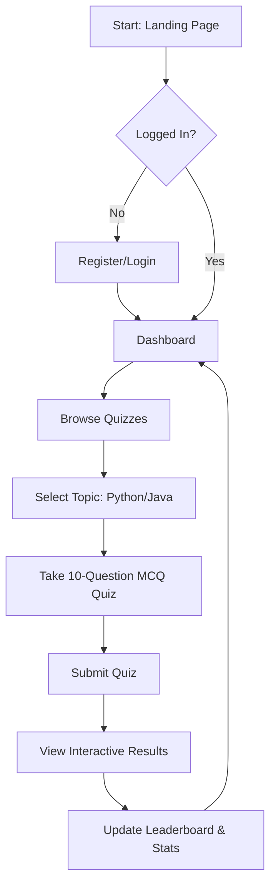
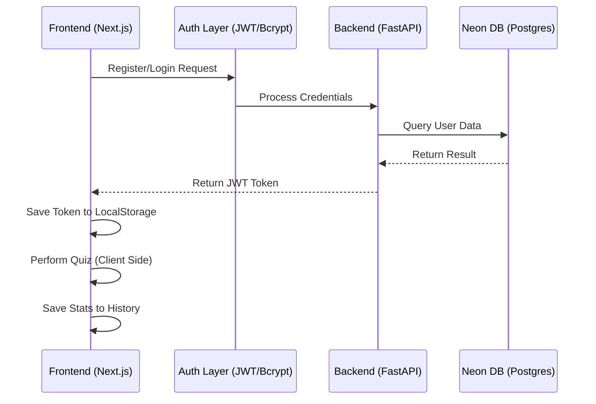

# 💎 QuizMaster: Online Quiz System - Final Project Report

## 1. Project Overview
**QuizMaster** is a premium, high-performance web application designed for interactive testing and engineering-level student assessment. It features a modern, responsive interface, a robust authentication system, and a dynamic quiz engine that tracks real-time progress and global rankings.

---

## 2. Architecture Details
The system follows a **Decoupled Architecture (Client-Server)** to ensure high scalability and ease of deployment.

- **Frontend (Presentation Layer)**: Built with **Next.js (React Framework)** for fast, server-side rendering and client-side interactivity.
- **Backend (API Layer)**: Powered by **FastAPI (Python Framework)** for high-concurrency performance and asynchronous request handling.
- **Database (Data Layer)**: Utilizing **Neon PostgreSQL (Serverless)** for reliable, relational data management and instant scalability.
- **Security**: Native **Bcrypt (v4.1.2)** for password hashing and **JWT (JSON Web Tokens)** for secure, stateless session management.

---

## 3. Technology Stack (App Details)
### Frontend
- **Framework**: Next.js 16.2.1
- **Styling**: Vanilla CSS (CSS Modules), Glassmorphism, Responsive Grid System.
- **State Management**: React Hooks (`useState`, `useEffect`, `useContext`).
- **Icons**: Emoji Glyphs (for zero-latency loading).

### Backend
- **Core**: FastAPI (Python 3.12+)
- **Server**: Uvicorn (ASGI Implementation)
- **Auth**: Native `bcrypt` (No `passlib` for maximum stability), `PyJWT`.
- **Database Connector**: `psycopg2-binary`.

### Infrastructure
- **Frontend Hosting**: Vercel
- **Backend Hosting**: Render
- **Database Hosting**: Neon Tech (Azure-backed PostgreSQL)
- **Version Control**: GitHub

---

## 4. Key Code Details
### A. The "Bulletproof" Authentication
We transitioned from `passlib` to **Native Bcrypt** to resolve initialization issues. The system handles large passwords securely and manages unique session tokens for every user.

### B. Interactive Quiz Engine
Implemented as a dynamic route (`/quizzes/[id]`) that uses:
- **`params` unwrapping**: Ensures compatibility with Next.js 15+ asynchronous route handling.
- **State Tracking**: Tracks multiple choices and computes scores instantly without server overhead.
- **Persistence**: Completed quizzes are logged in the user's `localStorage` history for dashboard statistics.

### C. Dashboard & Stats
The dashboard automatically parses the history to calculate **Average Score**, **Total Quizzes Taken**, and a **Dynamic Rank** (e.g., Novice, Pro, Master).

---

## 5. Flowchart: User Journey

---

## 6. Data Flow: System Interaction

---

## 7. Features & Value Add
- **Pro Dark & Light Themes**: Carefully selected color palettes (Pure Black background for Quiz taker, Clean White for Dashboard).
- **Engineering Content**: High-quality MCQ questions covering GIL, memory management, and list comprehensions.
- **Stat Persistence**: Real-time progress bars and ranking podiums (Gold/Silver/Bronze).

---

## 8. Deployment Strategy
- **Frontend**: CI/CD via **GitHub -> Vercel** (Global Edge Network).
- **Backend**: Managed via **GitHub -> Render** (Autoscaling).
- **Database**: **Neon (Azure)** for serverless pooling and instant cold starts.
